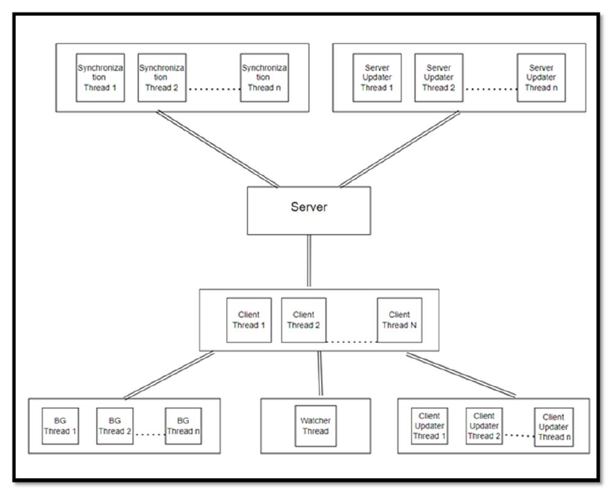

# Cloud-Storage-System
**How to Run**
1. Install eclipse.
2. Go to File>Import>Existing Projects into Workspace
3. Browse and select the project directory as root directory.
4. select Finish in the below
5. The project will open in Eclipse
6. Go to src>fileSync in project explorer
7. Run ServerRunner.java(only one server instance can be ran) 
and then run ClientRunner.java(multiple run will open multiple clients)
**Description**
The main goal of this project is to simulate a cloud storage system using multi-threading java programming to achieve maximum concurrency in the system. The main functionalities included in the project are File Sync, Delta Sync, Suspend/Resume and Sync status. We especially focused on building a Thread Management system that can achieve the highest concurrency around the system. Additionally, we used UDP protocol to transfer data across the network, which made concurrency programming increasingly difficult because of the unreliable nature of UDP.
*System Architecture*

**Thread Management**
The central threads used for this project are Synchronization Threads, Server Updater Threads, Client Thread, Block Generator Threads, Watcher Thread, Client Updater Threads. The
significance of each thread and the communication between them goes in the way mentioned below when an update or change happens:
• If a new file is added or edits have been made to increase any existing file size, the block generator will create blocks for those additional data.
• The watcher thread catches all the updates on the client-side.
• The server-side queue maintains a list for all incoming updating requests from the client.
• The synchronization thread handles each request from the message queue and synchronizes the updating process between all the server updater threads.
• The server updater thread updates the server files’ primary copy.
• Then, the server sends messages to all the clients' watcher threads about what updates took place on the server-side.
